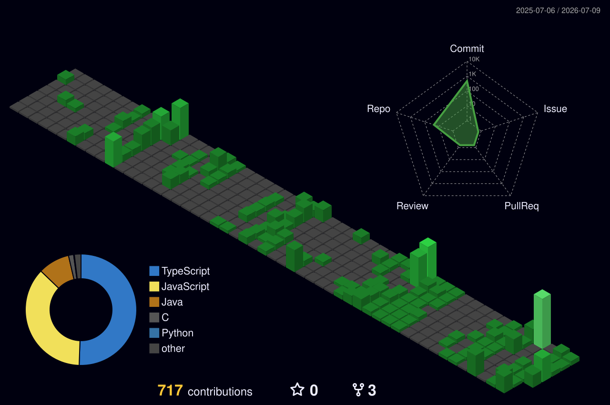

<h1 align="center">
  
</h1>

  

---

## About Me

- 3rd-Year CSE at RCOEM, Nagpur
- Full-Stack Developer (MERN + Next.js)
- AI/ML Engineer -- Reinforcement Learning, LLMs, Computer Vision
- Web Dev Team Member at Google Developer Group, RBU
- Active hackathon builder with deployed, production-grade projects

  
  
  

---

## Programming Languages

---

## Frontend Development

---

## Backend Development

---

## Databases

---

## AI / ML

---

## Cloud / DevOps

---

## Tools

---

## GitHub Analytics

 

  <!--  -->
  

 

<!-- 

  

 -->

---

## Contribution Calendar

  

---

## GitHub Activity Graph

  

---

## Productivity Stats

  

  

---
